# ☁️ SAP CPI: Integração Dinâmica com GitHub

> ** Este iFlow realiza a integração entre o SAP Cloud Integration e o GitHub por meio do SAP Open Connectors, permitindo a leitura de arquivos de um repositório público. O fluxo consome o conteúdo do arquivo README.md

<br> 

🔹 Funcionamento

O fluxo é iniciado por uma requisição HTTP (HTTPS Sender), que aciona o iFlow no SAP CPI. Em seguida, um componente Request Reply consome o conector do GitHub via SAP Open Connectors, realizando uma chamada ao endpoint responsável por recuperar o conteúdo do arquivo.

<p align="center">
  <!-- SAP BTP / CPI -->
  
  <!-- GitHub -->
  
  <!-- Open Connectors -->
  
  <!-- JSON / API -->
  
  <!-- HTTPS -->
  
  <!-- OAuth 2.0 (Comum em Open Connectors) -->
  
  <!-- REST -->
  
</p>


<p align="center">
  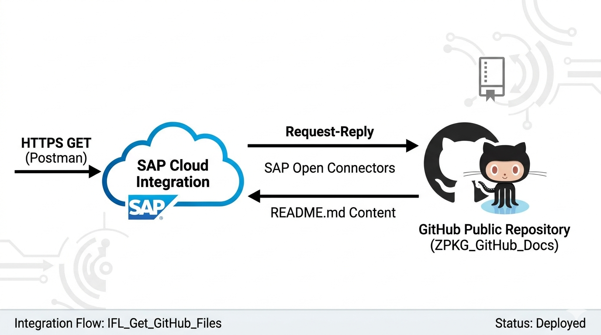
</p>

---

---

## 📋 Índice

<details open>
<summary><strong>Clique para expandir/recolher</strong></summary>

1. [🎯 Visão Geral](#-visão-geral)
2. [⚙️ Arquitetura da Solução](#️-arquitetura-da-solução)
3. [🔧 Configuração Open Connectors](#-como-funciona)
4. [📡 Configuração do iFlow](#-configuração-do-iflow)
5. [📡 Testando com Postman](#-testando-com-postman)
6. [🔐 Segurança & Boas Práticas](#-segurança--boas-práticas)
7. [📦 Downloads](#-downloads)
8. [🤝 Contribuindo](#-contribuindo)

</details>

---

<br>

## 🎯 Visão Geral

Este iFlow implementa uma integração entre o GitHub e o SAP Cloud Integration, utilizando o SAP Open Connectors como camada de abstração para consumo de APIs.

---

## ⚙️ Arquitetura da Solução


## 🚀 Como Funciona

### 📥 Entrada da Requisição

```
POST /github

```


## 🔧 Configuração do iFlow

> **Package:** `ZPKG_IntegrationGitHub_OpenConnectors`  
> **iFlow:** `IFL_GITHUB_INTEGRATION`

<br>


### 🔹 1. Extend Non SAP Connectivity
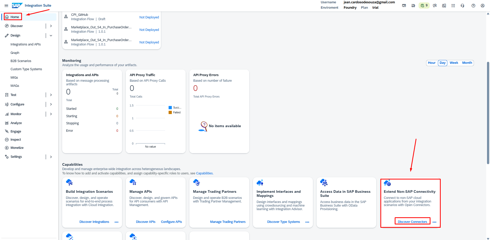

Nome do Package:
```
Discover Connectors
```

<br>

### 🔹 2. Conectar com o SAP ID
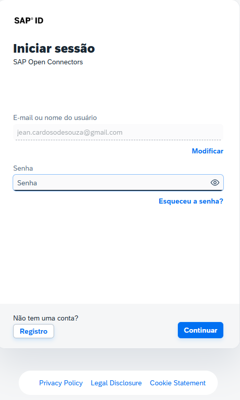

<br>

### 🔹 3. Home Open Connectors
Procurar o GitHub
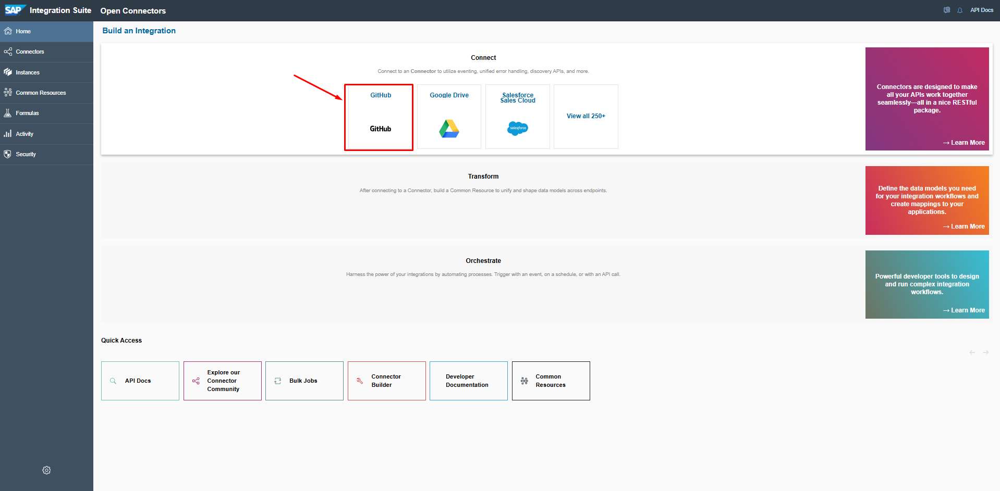

<br>

### 🔹 4. Na aba Connectors
Caso não apareça o GitHubs
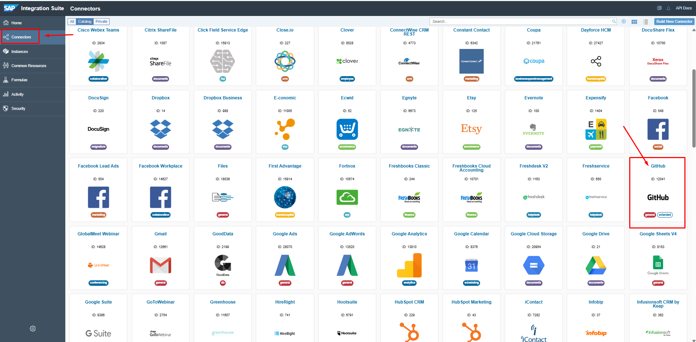

<br>

### 🔹 5. Configurando  Open Connectors para  o GitHub
```
Name: **Openconnectors_Github**
Configuration 
GitHub Organization: nome_da_sua_organização
GitHub Repository: **Openconnectors_Github**
```

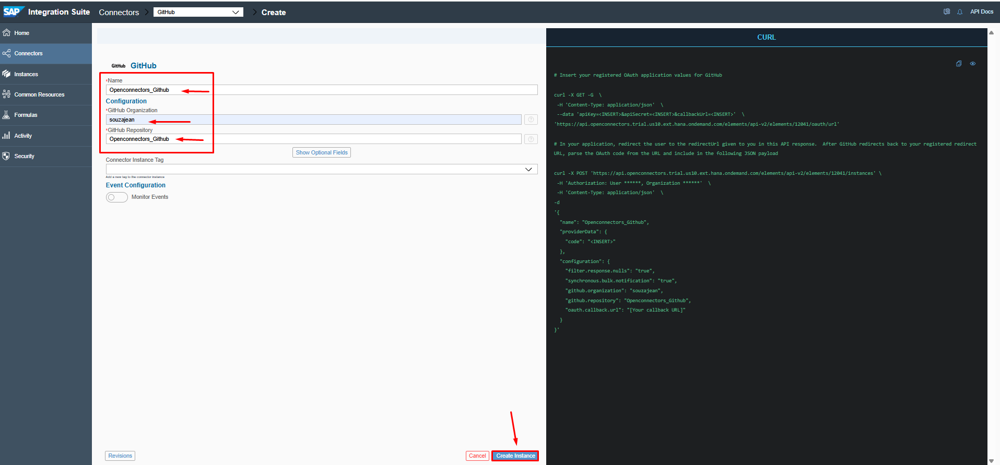

<br>

### 🔹 6. Criando o Repositorio no GitHub
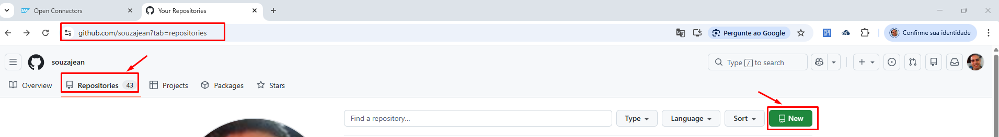

<br>

### 🔹 7. Adicionando o Repositorio no GitHub
```
Openconnectors_Github
```
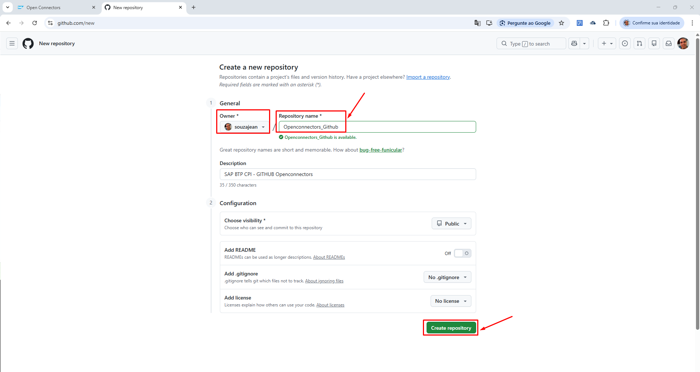

<br>

### 🔹 7. Adicionando o README no GitHub
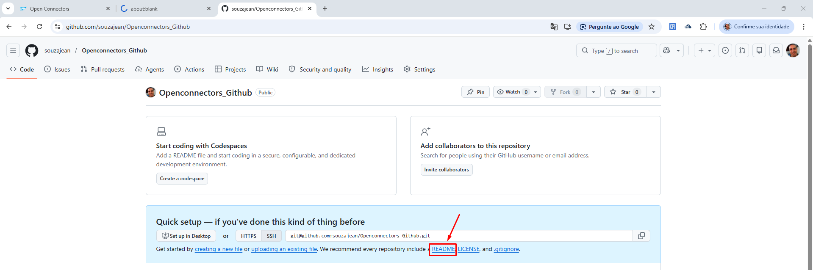

<br>

### 🔹 8. Escrevendo no README no GitHub
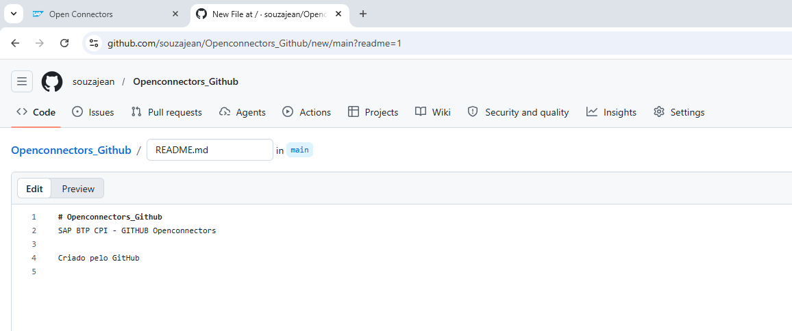

<br>

### 🔹 10. OpenConnectors 
Vamos realizar o teste de conexão
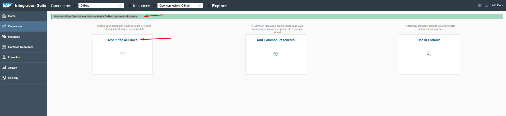

<br>

### 🔹 11. OpenConnectors procurar files
Vamos expandir files
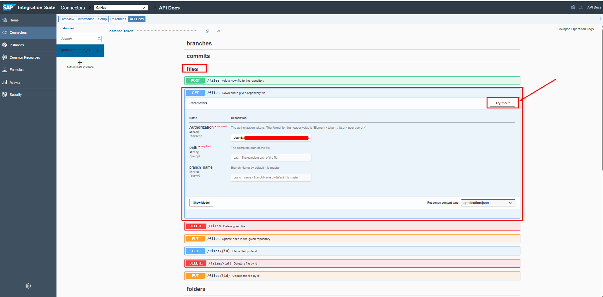

<br>

### 🔹 12. OpenConnectors 
Vamos anotar as credenciais para realizar o teste de conexão dentro do CPI
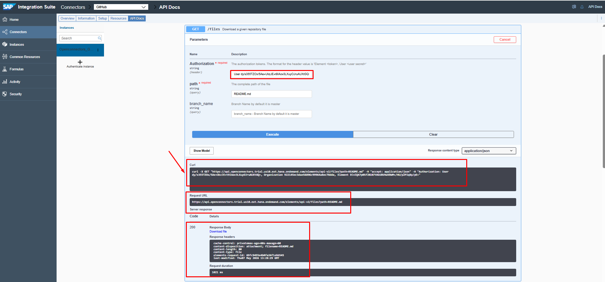

<br>

### 🔹 13. Credenciais do  OpenConnectors para o Github
Vamos usar as três conexões ("Authorization","Organization" e "Element" )
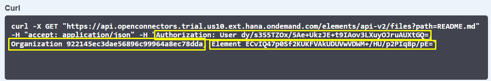

<br>

### 🔹 14. Com as Credenciais do  OpenConnectors para o Github anotadas
Três conexões ("Authorization","Organization" e "Element" )
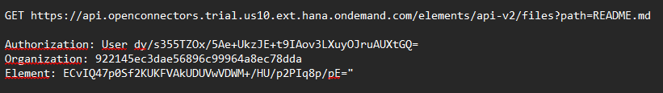

<br>

### 🔹 15. Manage Security 
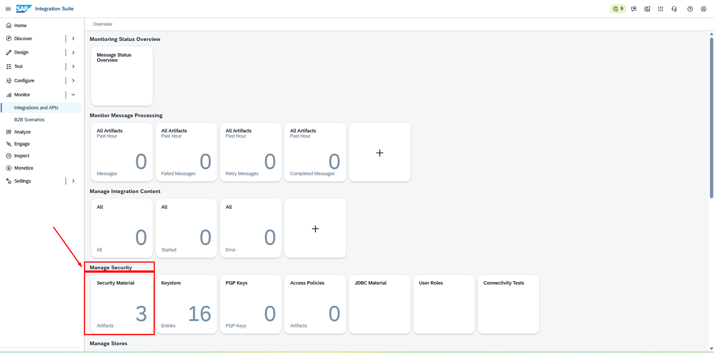

<br>

### 🔹 16. Adicionando o Manage Security
Vamos usar as três conexões ("**Authorization**","**Organization**" e "**Element**" )
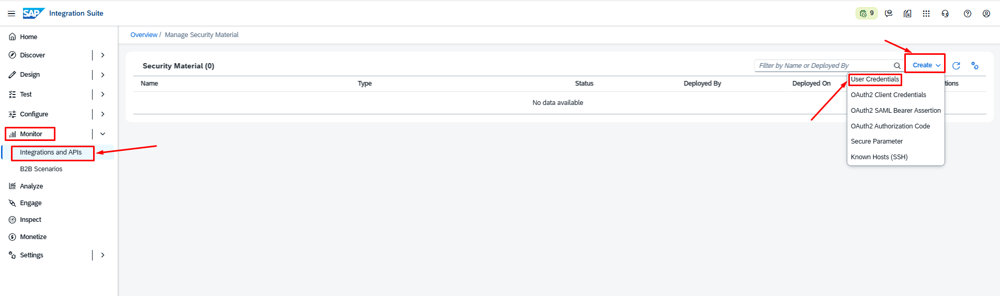

<br>

### 🔹 17. Configuranando o Manage Security
Selecionar o Type: **OpenConnectors**
Vamos usar as três conexões ("**Authorization**","**Organization**" e "**Element**" )
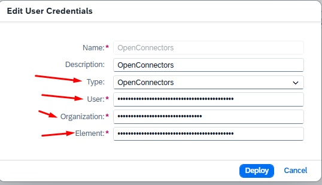

<br>

### 🔹 18. Adicionando o Package


<br>

### 🔹 19. Criação do Package
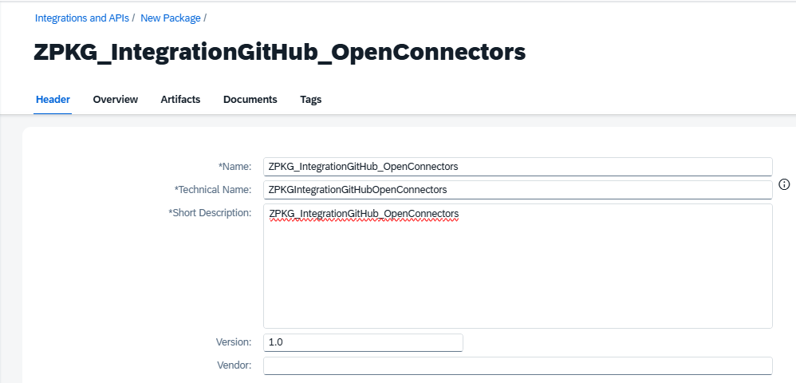

Nome do Package:
```
ZPKG_IntegrationGitHub_OpenConnectors
```


<br> 

### 🔹 20. Adição do Artefato iFlow
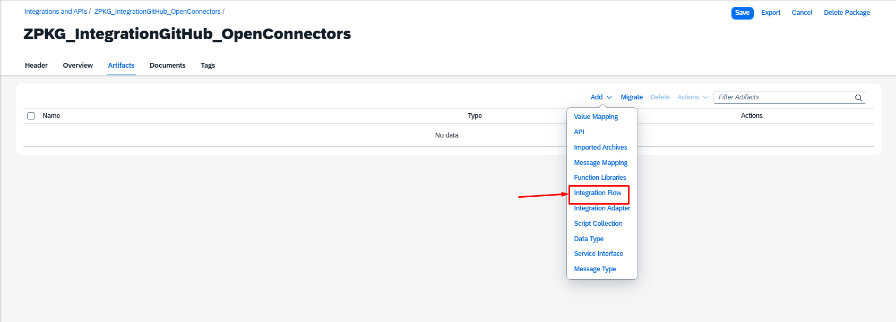

<br>

### 🔹 21. Nome do iFlow:
```
IFL_IntegrationGitHub_OpenConnectors
```

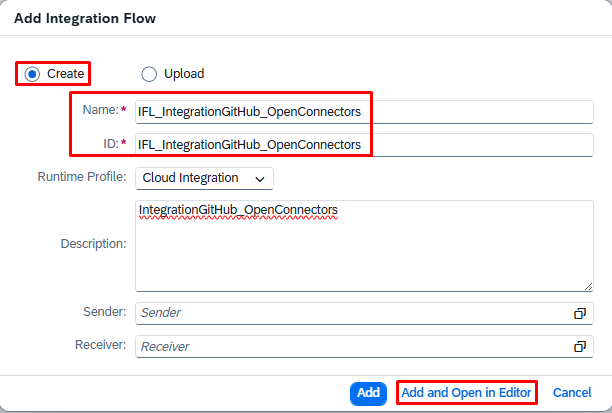

<br>

### 🔹 22. Adicionando o Adapter
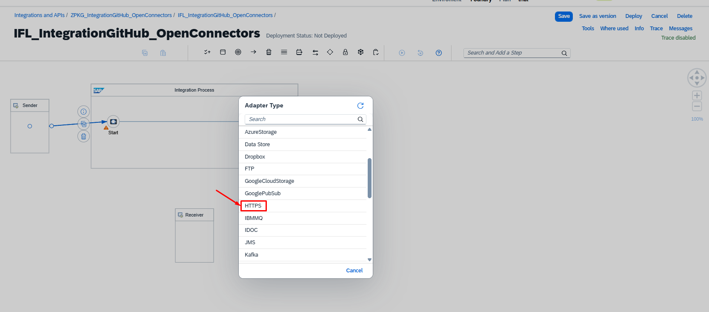

<br>

### 🔹 23. Configuração do Adapter HTTPS (Sender)


| Parâmetro    | Valor            |
|--------------|----------------- |
| Address      | /github          |
| Method       | GET              |
| Content-Type | application/json |

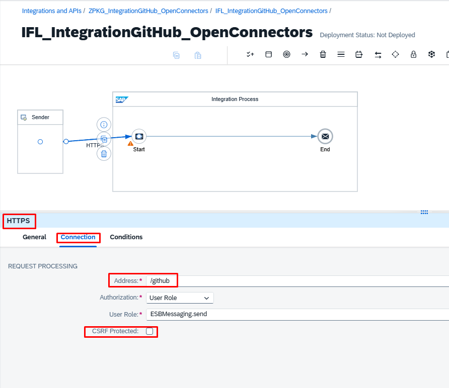

<br>


### 🔹 24. Adicionando o Request-Reply
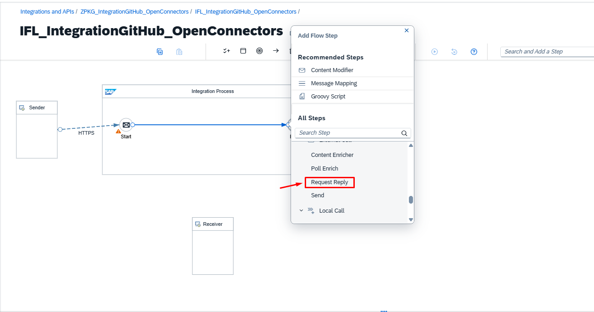

<br>

### 🔹 25. Adicionando o Adapter 
**OpenConnectors**
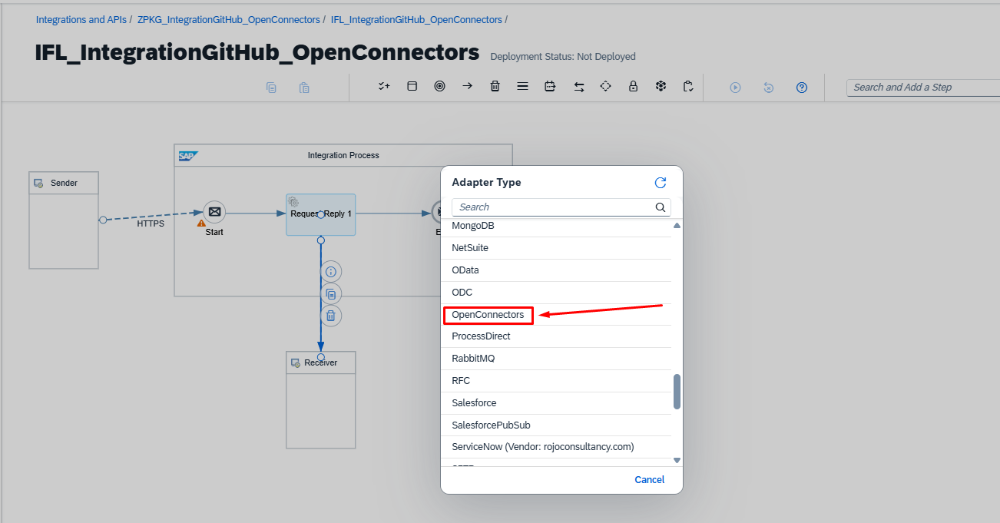

<br>

### 🔹 26. Request-Reply – Consulta APIs Externas

### 🗺️ Maps API →

| Parâmetro                     | Valor                                                                       | 
| ----------------------------- | --------------------------------------------------------------------------- |
| Base URL                      | https://api.openconnectors.trial.us10.ext.hana.ondemand.com/elements/api-v2 |
| Credential Name               | OpenConnectors                                                              | 
| Resource                      | /files?path=README.md                                                       |
| Method                        | GET                                                                         |
| Request Format                | JSON                                                                        |
| Response Format               | JSON                                                                        |
| Query Parameters for Resource |                                                               |
| Timeoout (in ms)              | 60000                                                         |

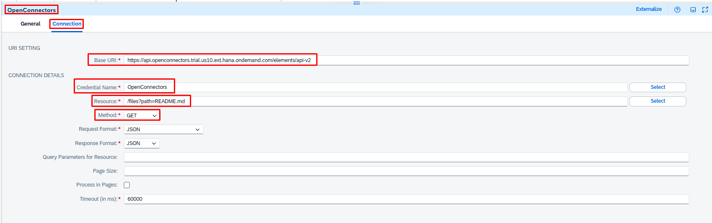

<br>
 
### 🔹 27. Postman

## 📡 Testando com Postman

### 🎯 Payload
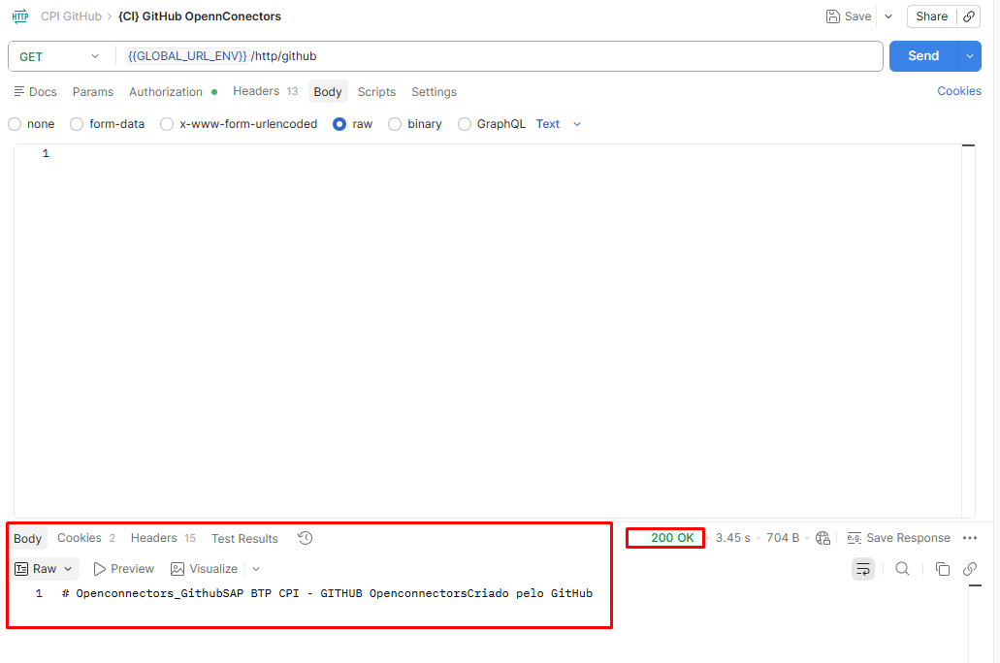

<br>


## 🔐 Segurança & Boas Práticas
⚠️ Importante: Este repositório é para fins educacionais e de demonstração.

### 🔒 Recomendações para Produção
